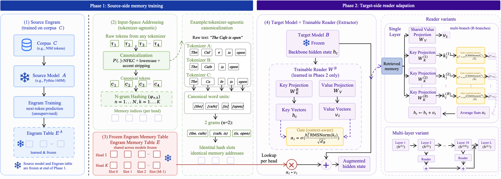

<h1 align="center">XMemTransfer</h1>
<p align="center"><strong>Cross-Model Memory Transfer via Target-Side Reader Adaptation</strong></p>

<p align="center">
  <a href="https://olaresearch.github.io/XMemTransfer"></a>
  <a href="https://huggingface.co/collections/OLAResearchX/xmemtransfer"></a>
  <a href="LICENSE"></a>
  <a href="https://github.com/OLAResearch/XMemTransfer/stargazers"></a>
</p>

<p align="center">
  XMemTransfer studies whether a frozen Engram-style external memory remains useful after it is
  detached from the model that trained it and attached to a different backbone. The central result
  is a reader-first view of memory portability: the stored table matters, but successful transfer
  depends on a lightweight target-side reader that can extract and align the signal.
</p>

## Framework

<p align="center">
  <a href="overview.pdf">
    
  </a>
</p>

<p align="center">
  <a href="overview.pdf"><strong>Open the full framework figure (PDF)</strong></a>
</p>

The transfer protocol has two stages:

1. Train a source-side Engram memory and freeze the learned memory table.
2. Attach that frozen table to a different target model and train only a lightweight target-side reader.

## Results Snapshot

Headline results from the saved project artifacts:

- All cells in the full 3 x 3 source-target transfer matrix are positive.
- The strongest intrinsic gain reaches `-15.7%` relative perplexity reduction.
- A stronger dual-layer 4-branch reader reaches `38.78` average OpenQA score in the saved Mistral artifacts.

Selected intrinsic transfer results:

| Source memory | Target model | Baseline PPL | Transferred PPL | Relative change |
| --- | --- | ---: | ---: | ---: |
| Pythia-160M | Pythia-410M | 21.900 | 21.559 | -1.6% |
| Pythia-160M | Qwen3.5-4B | 10.812 | 10.079 | -6.8% |
| Pythia-160M | TinyLlama-1.1B | 10.630 | 9.502 | -10.6% |
| Qwen3.5-0.8B | Pythia-410M | 22.936 | 21.375 | -6.8% |
| Qwen3.5-0.8B | Qwen3.5-4B | 10.524 | 9.585 | -8.9% |
| Qwen3.5-0.8B | TinyLlama-1.1B | 10.784 | 9.096 | -15.7% |

Selected downstream gains reported in the paper:

| Target | RTE | BoolQ | OpenBookQA | SciQ | TruthfulQA | RACE |
| --- | ---: | ---: | ---: | ---: | ---: | ---: |
| Qwen3.5-2B | +3.5 +/- 1.9 | +3.9 +/- 1.4 | +0.6 +/- 0.4 | +3.7 +/- 0.6 | -0.5 +/- 0.3 | -0.1 +/- 0.1 |
| Qwen3.5-9B | +0.7 +/- 0.3 | +0.6 +/- 0.2 | +0.3 +/- 0.3 | +3.2 +/- 0.7 | -0.8 +/- 0.3 | +1.1 +/- 0.2 |

OpenQA highlights from the saved reviewer-validation summary:

| Setting | Average score | Notes |
| --- | ---: | --- |
| Cross-model, R4, 30M/30M | 38.78 | Best saved cross-model OpenQA artifact |
| Same-model, R4 | 38.53 | Same-model reference |
| Cross-model, R4, 20M/20M | 38.48 | Stronger reader nearly closes the same-model gap |

## Quickstart

Prerequisites: Python >= 3.11, a CUDA-capable GPU, and `uv`.

```bash
bash run/00_install.sh
bash run/01_pilot.sh
```

The pilot validates the end-to-end pipeline on a compact transfer setting before larger runs.

## Reproducing the Paper

Experiments are grouped by paper section under `run/`.

| Paper section | Command |
| --- | --- |
| Tier 1 same-tokenizer | `bash run/10_tier1_same_tokenizer.sh` |
| Tier 2 cross-tokenizer | `bash run/11_tier2_cross_tokenizer.sh` |
| Tier 3 ablations | `bash run/12_tier3_ablations.sh` |
| Tier 4 scaling | `bash run/13_tier4_scaling.sh` |
| Extended CKA | `bash run/14_cka_extended.sh` |
| Downstream evaluation | `bash run/20_downstream_fw_matched.sh` |
| Domain alignment | `bash run/21_domain_alignment.sh` |
| Corpus control | `bash run/22_corpus_control.sh` |
| Baselines | `bash run/30_baselines.sh` |
| Figures and analysis | `bash run/40_analysis.sh` |

Source memories must be prepared before transfer runs:

```bash
bash run/02_source_memories.sh
```

See [run/README.md](run/README.md) for runtime estimates and ordering constraints.

## Repository Layout

```text
.
├── engram/        Core library (memory, adaptor, canonicalization, hashing, gating)
├── scripts/       Training, evaluation, and analysis entry points
├── configs/       YAML configs for experiment groups
├── tests/         Unit and integration coverage
├── run/           Section-level shell wrappers
├── lumi_scripts/  LUMI submission helpers
├── data/          Saved Phase 0 data and configs
└── assets/        README figures
```

## GitHub Star History

[](https://star-history.com/#OLAResearch/XMemTransfer&Date)

## License

Apache 2.0. See [LICENSE](LICENSE).
